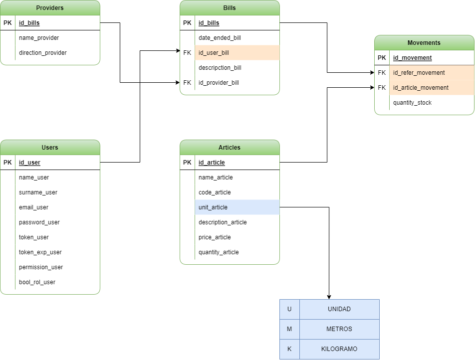

# s12-16-ft-php-next

## Objetivo General
  Aplicacion de gestion de inventario y facturacion, capaz de ingresar stock a travez de proveedores y realizar ventas de forma fisica que se vea reflejado en la aplicacion

### MVP
  - Inicio de sesion
  - Stock general
  - Ingreso de stock atravez de distintos proveedores
  - Crud de articulos
  - Sistema de venta, facturacion y descuento en stock
  - Alertas de falta de stock
  - Estadisticas de venta por mes y articulos mas consumidos
  - Generar o cargar excel de articulos
  - Generar PDF de ventas y/o factura

### Vistas
  - Inicio de sesion
  - Home (Estadisticas, alertas)
  - Stock (Excel del stock, filtros)
  - Crear factura (PDF factura)
  - Articulos (Crud)
  - Tabla de facturas (Historial de ventas y vista detallada, Excel de ventas)
  - Ingreso de stock (Distintos proveedores, historial de ingresos)

### Diagrama entidad relación

